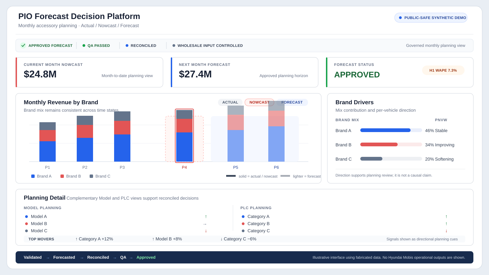
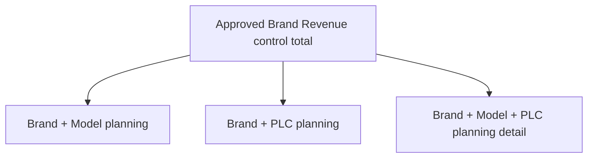
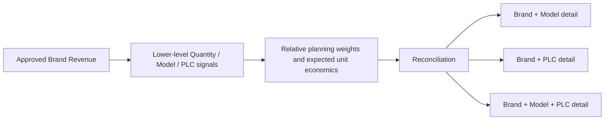
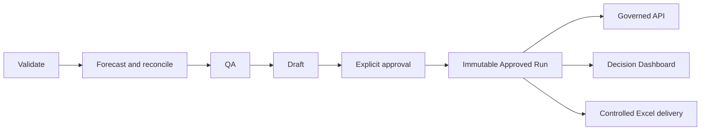

# Hyundai Mobis PIO Accessory Forecasting & Decision Platform

Turn monthly PIO accessory demand signals into a governed planning view that stays coherent from Brand Revenue to Model and PLC detail.

> A sanitized UCLA MEng capstone case study developed with Hyundai Mobis / Mobis Parts America. This public repository contains no company data, production source code, Sponsor workbooks, operational outputs, credentials, or claim of production deployment or measured commercial impact.

*Illustrative interface using synthetic data; no Hyundai Mobis data or proprietary outputs are shown.*

PIO means **Port-Installed Options**: accessories installed before vehicles are delivered to dealers or customers. PLC is the accessory-category planning hierarchy used in this project.

## 30-Second Overview

- **Business problem:** Monthly planning needs a credible Revenue outlook, vehicle-volume context, and operational accessory detail without allowing those views to contradict one another.
- **Historical validation:** Historical one-month-ahead validation: **approximately 7.3% Weighted Absolute Percentage Error (WAPE)**. This is a historical rolling-origin backtest result—not a guarantee of future accuracy or a claim of measured commercial impact.
- **My role:** Within a UCLA MEng team capstone, I led the forecasting pipeline, time-aware validation, reconciliation, governance, QA, approved-run handoff, and Sponsor Excel delivery workstreams.
- **Technical approach:** Leakage-safe rolling-origin evaluation, governed per-Brand method selection, bottom-up Quantity signals, reconciliation, explicit release controls, and a server-side application integration pattern.
- **Decision outputs:** One Approved Run provides consistent Brand + Model, Brand + PLC, and Brand + Model + PLC planning detail to the API, Dashboard, and controlled Excel delivery.
- **Technical stack:** Python, pandas, scikit-learn, statsmodels, XGBoost, openpyxl, FastAPI, Next.js, React, TypeScript, Ant Design, ECharts, pytest, and GitHub Actions were used in the private implementation.

## Why this is a decision system—not just a model

The central design problem was to protect the approved Brand-level Revenue outlook while still providing useful operational detail. Vehicle Model and PLC are complementary planning dimensions rather than a strict parent-child hierarchy. Lower-level planning signals are reconciled to governed Brand-level Revenue control totals, so operational detail cannot create a competing top-line forecast.

### Reconciliation logic

Bottom-up detail provides distribution signals; it does not redefine the governed top-line Revenue forecast. PLC Revenue is therefore a reconciled planning allocation, not a separately selected Revenue model at every lower-level node.

## Forecasting and validation

Different Brands can exhibit different demand patterns. The governed Revenue portfolio used a pooled Ridge model, a pooled Random Forest, and a working-day-adjusted seasonal method across the Brand-level forecasts.

Quantity planning combined bottom-up model-level signals, including XGBoost where selected, with an aggregate ETS control when ETS provided the stronger governed total forecast. Lower-level quantities were reconciled to that control total, with historical-share methods supporting PLC allocation.

Candidate approaches were evaluated with leakage-safe rolling-origin backtesting: each historical test period used only the information available at that forecast origin. Selection considered accuracy, stability, operational practicality, interpretability, and reproducibility. Routine source refreshes can create a new run, but they do not silently reselect the official method.

| Brand | Governed Revenue Method |
| ----- | ----------------------- |
| HMA | Pooled Ridge Regression |
| GMA | Pooled Random Forest |
| KUS | Working-Day-Adjusted Seasonal |

Different brands selected different methods because their historical demand patterns differed. Candidate methods were evaluated with leakage-safe rolling-origin validation, then the selected method was frozen in a governed registry rather than silently reselected on routine refreshes.

For the selected Brand Revenue portfolio, the **approximately 7.3% WAPE** figure is specifically the historical **one-month-ahead (H1)** rolling-origin result. H2/H3 were governance guardrails for coverage and stability; this is not a combined multi-horizon score.

## Business rules that keep planning outputs trustworthy

### Actual, Nowcast, and Forecast

A partial month is useful evidence, but it is not a closed Actual. The system labels completed periods as **Actual**, the in-progress period as **Nowcast**, and future planning periods as **Forecast**.

The current-month Revenue nowcast blends the frozen pre-month Brand forecast with a leakage-safe month-to-date completion-curve projection using governed day-specific weights.

### Regular business and Fleet component

Regular per-vehicle Revenue (PNVW) remains a regular, non-Fleet metric. The separately governed Fleet component is kept distinct, added once to the all-in outlook, and not manufactured into vehicle-model attribution. This prevents double counting, regular-PNVW contamination, and misleading Model detail.

### Approved Run lineage

A failed upload, run, reconciliation, or QA check cannot replace the current Approved Run. The API, Dashboard, and Excel delivery share the same approved source.

## My Contribution and Team Boundary

This was a UCLA MEng team capstone. I led the work that turned forecasting analysis into governed planning outputs; the project was delivered collaboratively across modeling research, validation, product delivery, and sponsor communication.

- Led the forecasting-system and release-governance design and implementation.
- Built the Brand-level Revenue evaluation and governed method-selection framework.
- Designed Model and PLC planning paths reconciled to approved Brand-level Revenue control totals.
- Defined Wholesale, regular PNVW, separately governed Fleet, and partial-month Nowcast semantics.
- Led QA, approved-run handoff, decision-support delivery, and Sponsor Excel delivery workflow design.

Teammates contributed across the broader capstone. This repository does not claim that I independently completed all modeling, product, or sponsor-facing work.

## Clean-Room Conceptual Examples

The short programs in [`examples/`](examples) use fabricated data only. They are clean-room teaching examples of reconciliation, time-aware backtesting, and explicit approval—not private implementation code, an API, or a dashboard.

- [`synthetic_reconciliation.py`](examples/synthetic_reconciliation.py): reconcile a synthetic Brand × Model × PLC matrix to its row and column controls.
- [`rolling_origin_backtest.py`](examples/rolling_origin_backtest.py): construct evaluation splits that never train on future observations.
- [`governed_release_demo.py`](examples/governed_release_demo.py): show that failed drafts cannot replace an Approved Run.

## Technical Deep Dives

1. [Architecture and system boundaries](docs/architecture.md)
2. [Forecasting methodology and planning semantics](docs/forecasting-methodology.md)
3. [Governance, QA, and approved-release lifecycle](docs/governance-and-release.md)

## Design Lessons and Tradeoffs

- Business definitions can matter as much as model selection.
- Time-aware validation answers a different question than random train/test splitting.
- Reconciliation makes operational detail useful without weakening the top-line decision.
- Governance, QA, lineage, and delivery are required for dependable forecasting decision support.
- A simpler, explainable method can be the better decision when extra complexity adds little operational value.

## Confidentiality and Repository Scope

This documentation-first repository is a sanitized public case study. It excludes raw or row-level company data, actual Revenue values, monthly forecast tables, Sponsor workbook content, private code, internal paths or URLs, deployable artifacts, credentials, proprietary screenshots, and unverified business-impact claims. The SVG and Python examples are original and synthetic; they are not sources of Official Forecast values.
