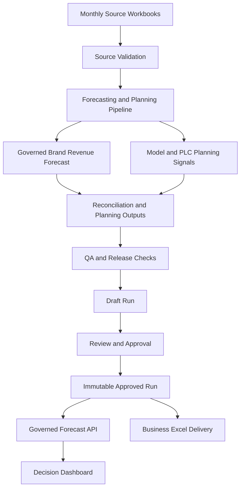

# Hyundai Mobis PIO Accessory Forecasting & Decision Platform

A sanitized UCLA MEng capstone case study developed with Hyundai Mobis / Mobis Parts America.

**Forecasting -> Hierarchical Reconciliation -> QA -> Governed Release -> Decision Support -> Excel Delivery**

> This documentation-first repository contains no raw company data, production source code, internal workbooks, business-sensitive outputs, or credentials. It is not a claim of production deployment or measured commercial impact.

PIO stands for **Port-Installed Options**: accessories installed before vehicles are delivered to dealers or customers.

PLC is the accessory-category planning hierarchy used in this project.

## At a glance

- **Planning problem:** Turn monthly PIO accessory demand signals into a credible planning outlook across Revenue, vehicle-model, and accessory-category views.
- **Decision challenge:** Keep the official top-line view consistent with lower-level planning detail, distinguish partial-month evidence from closed Actuals, and prevent unreviewed runs from reaching decision users.
- **My primary focus:** Led the forecasting-system, governance, time-aware validation, reconciliation, approved-run handoff, QA, and decision-support delivery workstreams within a UCLA MEng team capstone.
- **Technical and business lens:** Combined forecasting evaluation with explicit business semantics, hierarchical controls, release lineage, and delivery contracts instead of treating the project as a standalone model exercise.
- **Evidence boundary:** This public case study intentionally omits private data, model scores, operational outputs, and company-specific implementation details; it reports no unverified performance or business-impact metrics.

### Read this in order

1. [Architecture and system boundaries](docs/architecture.md)
2. [Forecasting methodology and planning semantics](docs/forecasting-methodology.md)
3. [Governance, QA, and approved-release lifecycle](docs/governance-and-release.md)

## Business Problem

Monthly accessory planning needs more than a single top-line estimate. Planning teams need a credible Revenue outlook, accessory-unit signals, vehicle-volume context, and a way to understand how the view changes as a month progresses. Those outputs must agree across brand, vehicle model, and accessory-category views, and they must be released without confusing partial-month information with final results.

This project addresses that problem as a decision system, not just a forecasting notebook: it combines time-aware model evaluation, hierarchical planning, business-rule governance, controlled release, application delivery, and business-facing Excel output.

## My Contribution and Team Boundary

This was a UCLA MEng team capstone. I led the work that turns forecasting analysis into governed planning outputs; the project was delivered collaboratively across modeling research, validation, product delivery, and sponsor communication.

### My primary responsibilities

- Forecasting system and release governance: led the design and implementation of the governed planning workflow.
- Time-aware validation and selection: built the brand-level Revenue evaluation and method-selection framework.
- Reconciliation: designed Model and PLC planning paths that reconcile to approved brand-level Revenue control totals.
- Business semantics: defined Wholesale context, regular per-vehicle Revenue, separately governed Fleet treatment, and partial-month Nowcasts.
- Approved-run handoff and QA: led the contract from approved forecasts to the governed API, decision Dashboard, controlled update workflow, and Excel delivery, including validation and release checks.
- Decision-support delivery: led technical handoff and local delivery-workflow design for stakeholder-facing planning outputs.

### Team collaboration

- Teammates contributed to the broader capstone across modeling research, validation, product delivery, and sponsor communication.
- I incorporated stakeholder feedback into planning semantics and decision presentation while preserving the governed forecast contract.

## System Architecture



The architecture keeps one approved release as the source for both the Dashboard and Excel delivery. It separates forecasting and approval responsibilities from browser presentation.

## Forecasting Approach

### Revenue forecasting

Different brands can exhibit different demand patterns, so the system evaluates methods by brand rather than assuming a single algorithm fits every business segment. Candidate approaches are assessed with leakage-safe, time-aware backtesting. A method is selected and frozen per brand based on accuracy, stability, operational practicality, and interpretability.

Routine source refreshes do not silently reselect the official method. This makes a released forecast reproducible and makes a change in method an explicit governance decision rather than an incidental side effect of a data refresh.

### Quantity planning

Accessory-unit planning uses vehicle-model signals and historical accessory-category patterns to support operational detail. These lower-level signals are planning inputs, not an independent replacement for the approved brand-level Revenue forecast.

### PNVW and Wholesale context

Regular PNVW is regular accessory Revenue per selected regular Wholesale vehicle. The separately governed Fleet component is excluded. This creates a per-vehicle planning context without mixing a distinct program component into the regular metric.

### Current-month nowcast

The system distinguishes completed **Actual**, current partial-month **Nowcast**, and future **Forecast** periods. Incomplete month-to-date information is useful for updating the near-term outlook, but it is not presented as final Actual.

## Hierarchical Forecasting & Reconciliation

The planning hierarchy is:

```text
Total
  |
Brand
  |
Vehicle Model
  |
PLC / Accessory Category
```

Independent figures at several levels can conflict. The official brand-level Revenue forecast is the governed control total. Lower-level Quantity planning signals, historical PLC patterns, and reconciled allocation margins support operational Model and PLC planning.

PLC Revenue is a reconciled allocation of the approved brand forecast, not a separately selected Revenue model at every lower-level node. This protects the top-line decision while still giving planning teams actionable detail.

## Business-Rule Governance

Real planning systems require business rules in addition to statistical models. A separately governed Fleet component illustrates the principle:

```text
Regular business
+
Separately governed Fleet component
=
All-in business outlook
```

The separation prevents double counting, contamination of regular per-vehicle metrics, and false vehicle-model attribution. The component is included once in all-in views while remaining distinguishable wherever its business meaning matters.

## Governed Release Pipeline

```text
Upload
-> Validate
-> Run Forecast
-> Reconcile
-> QA
-> Draft
-> Review
-> Approve
-> Immutable Approved Run
```

A failed upload, forecast run, reconciliation, or QA check never replaces the currently approved forecast. Approval is the only action that changes downstream Dashboard and Excel outputs.

This is production-style governance designed for a capstone decision system. It is not a claim of enterprise production deployment or business adoption.

## API & Application Architecture

```text
Forecasting System of Record
        |
Governed Forecast API
        |
Website Backend / Proxy
        |
Next.js Dashboard
```

The browser does not fit models or independently rebuild Official Forecast values. The system backend remains the source of truth; the governed API exposes Approved Run outputs to the application backend, and the browser does not receive credentials. Dashboard and Excel delivery trace back to the same approved release.

## Dashboard / Decision Support

The Dashboard is organized around planning decisions rather than charts alone.

- **Executive Overview:** current outlook and next planning period.
- **Brand Performance:** Revenue movement, Wholesale scale, and per-vehicle context.
- **Revenue and Quantity:** official planning totals and components.
- **Wholesale Inputs:** visibility into planning drivers and availability.
- **Model & PLC Planning:** operational vehicle-model and accessory-category detail reconciled to official totals.
- **Top Movers:** governed comparisons that surface material Brand + PLC changes across supported Actual and Forecast contexts.
- **Governance & QA:** release state and quality evidence.
- **Output Center:** controlled business delivery.
- **Update Forecast:** protected workflow for creating a future approved release.

## Reliability & QA

Forecast accuracy alone is not enough; the system also verifies structural and business consistency before publication. Release checks cover source and schema validation, Revenue and Quantity reconciliation, hierarchy consistency, Approved Run consistency, missing or unknown category checks, Fleet double-counting prevention, workbook validation, and automated tests.

## Technical Stack

Verified technologies used in the private implementation:

- **Forecasting and data:** Python, pandas, scikit-learn, statsmodels, XGBoost, openpyxl.
- **Backend:** FastAPI, Pydantic, HTTPX, Uvicorn.
- **Frontend:** Next.js, React, TypeScript, Ant Design, ECharts.
- **Engineering:** pytest, Node.js test runner, GitHub Actions, Git.

## Key Engineering Decisions

1. Keep one official forecast source instead of allowing each interface to calculate its own total.
2. Govern model selection explicitly rather than silently rerunning it on every refresh.
3. Treat a partial month as a Nowcast, not final Actual.
4. Reconcile lower-level planning outputs to official brand-level Revenue.
5. Preserve the Fleet component as a separate business rule.
6. Require explicit approval before a release becomes the downstream source.
7. Give Dashboard and Excel outputs the same release lineage.

## What I Learned

- Business definitions can matter as much as model selection.
- Forecast validation must respect time; random train/test splits do not answer the planning question.
- Hierarchy consistency matters when forecasts drive operational decisions.
- A dependable forecasting product needs governance, QA, lineage, and delivery—not only predictions.
- Stakeholder feedback can improve presentation semantics without changing the underlying forecast.
- Simpler, explainable methods can be preferable when added model complexity provides little decision value.

## Confidentiality

This repository is a sanitized technical case study of a UCLA MEng capstone project developed with Hyundai Mobis / Mobis Parts America. Production implementation code, company datasets, internal workbooks, business-sensitive outputs, and deployment credentials remain private. Examples shown here are architectural, generalized, or synthetic.

## Supporting Documentation

- [Architecture](docs/architecture.md)
- [Forecasting methodology](docs/forecasting-methodology.md)
- [Governance and release](docs/governance-and-release.md)

## Repository Scope

This is a documentation-first case study. It intentionally contains no executable forecasting, Dashboard, or API code; no company data; no operational outputs; and no proprietary screenshots.
