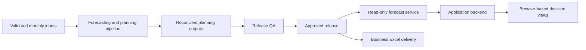

# Architecture

This document describes the system at a conceptual level. It does not reproduce implementation code, private schemas, endpoint names, deployment configuration, or business-sensitive outputs.

## Design goal

The system delivers planning information without allowing presentation layers to create competing versions of the forecast. A controlled approved release is the shared contract between the forecasting pipeline, Dashboard, and Excel delivery.

## Information flow

The application backend acts as a server-side adapter. It can shape approved information for the user interface while keeping credentials and release logic out of the browser.

## Decision boundaries

| Component | Responsibility | Does not do |
|---|---|---|
| Forecasting pipeline | Validate inputs, generate forecasts, reconcile planning outputs, record QA | Serve as a browser UI |
| Approval workflow | Decide which completed run becomes current | Silently promote a failed or draft run |
| Governed forecast service | Read approved-release outputs | Refit models per request |
| Application backend | Securely request and adapt approved information | Become a second forecasting engine |
| Dashboard | Explain approved planning information | Receive credentials or recalculate official totals |
| Excel delivery | Provide controlled business output | Diverge from the approved release |

## Period semantics

Every decision view needs explicit time labeling:

| Period type | Meaning |
|---|---|
| Actual | Completed, observed period |
| Nowcast | Current incomplete period with available month-to-date evidence |
| Forecast | Future planning period |

This distinction prevents a partial period from being mistaken for a closed financial result.

## Why the separation matters

The architecture makes release lineage visible: one approved release feeds both the Dashboard and business Excel output. It also limits the risk that a browser calculation, stale local file, or exploratory workflow is presented as the official planning view.
