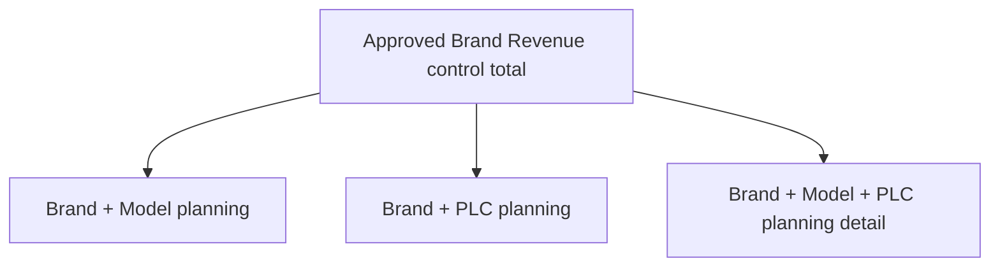
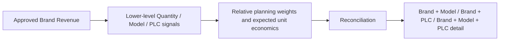

# Forecasting Methodology and Planning Semantics

This is a high-level methodology overview. It deliberately omits company data, actual Revenue values, private feature definitions, registry identifiers, and deployable artifacts.

**Case-study map:** [Overview](../README.md) | [Architecture](architecture.md) | [Governance and release](governance-and-release.md)

## Revenue model evaluation

The system evaluates candidate forecasting approaches by brand using leakage-safe, time-aware backtesting. This means each historical test period is evaluated using only information that would have been available at that point in time.

The governed Brand Revenue portfolio used a pooled Ridge model, a pooled Random Forest, and a working-day-adjusted seasonal method across the selected Brand forecasts. These are model-family descriptions, not published private implementation code.

Quantity planning combined bottom-up model-level signals, including XGBoost where selected, with an aggregate ETS control when ETS provided the stronger governed total forecast. Lower-level quantities were reconciled to that control total, with historical-share methods supporting PLC allocation.

**Historical one-month-ahead validation: approximately 7.3% WAPE.** This is the selected Brand Revenue portfolio's H1 rolling-origin backtest result. H2/H3 were coverage and stability guardrails, so this figure is neither a combined multi-horizon score nor a guarantee of future accuracy or commercial impact.

Selection considers more than a single error score:

- accuracy across the defined evaluation windows;
- stability across forecast horizons;
- operational practicality;
- interpretability for planning users; and
- repeatability under governed release rules.

One method is selected and frozen for each brand. A routine data refresh can create a new forecast run, but it does not silently redefine the official method.

## Wholesale as planning context

Vehicle Wholesale provides an important planning driver and denominator. The system preserves the distinction between an explicit planned zero and an unavailable input. When approved plans are unavailable, governed fallback logic is documented and visible rather than hidden inside a model result.

Regular PNVW is regular accessory Revenue divided by selected regular Wholesale vehicles. It is a per-vehicle Revenue context metric, not an all-in metric that absorbs separately governed Fleet activity.

## Current-month nowcasting

For the current incomplete month, month-to-date information is used to update the near-term view. The result is labeled a Nowcast. Completed historical months remain Actual, and future periods remain Forecast.

The current-month Revenue nowcast blends the frozen pre-month Brand forecast with a leakage-safe month-to-date completion-curve projection using governed day-specific weights.

## Complementary planning dimensions and reconciliation

Vehicle Model and PLC are complementary planning dimensions rather than a strict parent-child hierarchy. Lower-level planning signals are reconciled to governed Brand-level Revenue control totals, so operational detail cannot create a competing top-line forecast.

The approved Brand-level Revenue forecast is the control total. Lower-level Quantity signals, Model context, PLC patterns, relative planning weights, and expected unit economics are reconciled into operational detail. Bottom-up detail provides distribution signals; it does not redefine the governed top-line Revenue forecast.

PLC Revenue is a reconciled planning allocation of the approved Brand forecast, not a separately selected Revenue model at every lower-level node.

## Separate business components

Some program components require their own business treatment. The system keeps such a component separate from regular business metrics, adds it once to the all-in outlook, and avoids attributing it to a vehicle model without a governed basis. This is important for preventing double counting and misleading per-vehicle context.

**Next:** [Governance, QA, and approved-release lifecycle](governance-and-release.md)
