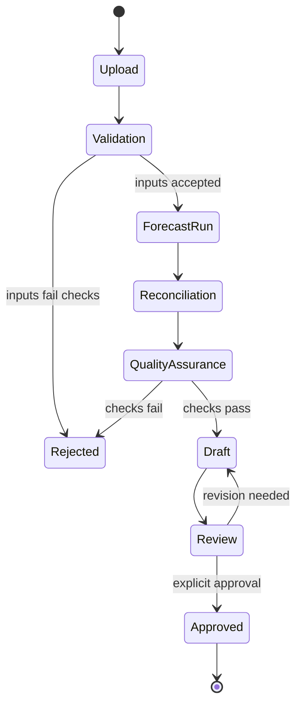

# Governance and Release

Forecasting is useful for planning only when users can tell which result is current, how it was validated, and whether it is safe to use.

## Controlled release lifecycle

Only an explicit approval promotes a draft to an immutable approved release. A failure at upload, forecasting, reconciliation, or QA leaves the previous approved release unchanged.

## Release checks

The release process verifies both statistical and operational integrity:

- source-role and schema validation;
- missing and unknown category checks;
- Revenue and Quantity reconciliation;
- hierarchy consistency;
- approved-release consistency across delivery channels;
- protection against double counting separate components;
- business workbook validation; and
- automated regression tests.

These checks complement model evaluation. A forecast can be statistically plausible but still be unsafe to publish if its hierarchy, input contract, or business semantics are inconsistent.

## Shared release lineage

The approved release is the only source for official Dashboard content and controlled Excel delivery. This design means a user is not asked to decide which of several exports, browser calculations, or local files is authoritative.

## Scope and privacy

This case study describes governance patterns without exposing client data, implementation code, operational paths, credentials, internal endpoints, output values, or screenshots. Any future demonstration should use clearly labeled synthetic data and remain separate from the private implementation.
